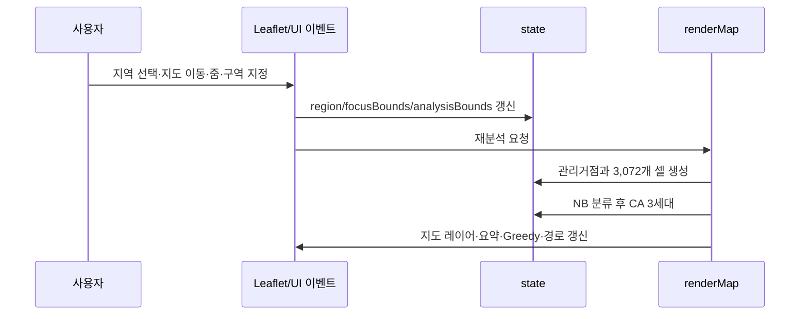

> **이전 버전 기록:** 아래 문서는 Leaflet 기반 1차 버전의 이력입니다. 현재 3D 버전의 실행·구조·데이터 한계·검증·배포 방법은 [README.md](README.md)를 확인하세요. 현재 진입점은 app.mjs이며 app.js는 사용하지 않습니다.

# LAND:15 상세 인수인계 문서

최종 갱신: 2026-09-09  
운영 저장소: <https://github.com/leejuhan-1214/ToGangDDaKK>  
배포 사이트: <https://leejuhan-1214.github.io/ToGangDDaKK/>  
기준 브랜치: `main`

이 문서는 새 담당자가 별도의 구두 설명 없이 프로젝트의 목적과 구현 상태를 파악하고, 로컬 실행·수정·검증·배포까지 이어받을 수 있도록 작성했습니다.

## 1. 프로젝트 목적과 범위

LAND:15는 UN SDG 15.3의 사막화 방지와 토지 황폐화 중립을 설명하기 위한 교과 융합형 교육 프로토타입입니다. 사용자는 실제 위성영상 베이스맵을 탐색하면서 다음 질문의 연결 관계를 체험합니다.

1. 어디가 사막화 위험지역인가? — Gaussian Naive Bayes + 셀룰러 오토마타
2. 어느 관리거점이 담당해야 하는가? — Voronoi 최근접 배정
3. 제한된 예산으로 어디부터 복원할 것인가? — Greedy 선택
4. 관리거점과 현장을 어떻게 연결할 것인가? — Prim MST + A*

현재 버전의 목표는 알고리즘의 역할과 상호작용을 보여주는 것입니다. 실제 위성자료를 내려받아 과학적으로 사막화를 판정하는 서비스는 아직 아닙니다.

### 반드시 유지할 데이터 고지

| 구분 | 실제 여부 | 설명 |
| --- | --- | --- |
| Esri World Imagery 배경 | 실제 영상 | 실시간이 아니며 지역마다 촬영일·해상도가 다름 |
| 경계와 지명 타일 | 실제 지도 데이터 | Esri reference tile 사용 |
| 위험도와 6개 환경지표 | 합성 | 위·경도 기반 수학적 공간장으로 생성 |
| 분류 확신도 | 모의 지표 | 검증 데이터에서 계산한 정확도나 보정 확률이 아님 |
| 비용·인구·복원 효과 | 합성 | UI와 최적화 흐름 시연용 |
| 관측 예시일 | 예시값 | 실제 타일의 촬영일과 연결되지 않음 |

화면, 발표자료와 문서에서 `실시간 위성 분석`, `실제 위험도`, `검증된 예측 정확도`라고 표현하면 안 됩니다.

## 2. 현재 완료된 기능

- 고비, 사헬, 아랄해 기본 지역 전환
- Leaflet 기반 실제 위성영상 탐색
- 지도에서 두 모서리를 클릭하는 사용자 지정 사각 분석구역
- 현재 보이는 지도 전체를 64 × 48, 총 3,072개 셀로 자동 재분할
- 지도 이동·확대·축소 종료 후 화면 범위 자동 재계산
- 위·경도에 고정된 다중 스케일 합성 공간장
- 좌표 기반 셀 ID (`GEO-N...-E...` 형식)
- Gaussian Naive Bayes 4등급 분류
- Moore 8-이웃 셀룰러 오토마타 3세대 보정
- 지도 좌표에 고정된 관리거점 생성과 Voronoi형 셀 배정
- Prim 최소 신장 트리 관리망
- 비용 대비 효과 기반 Greedy 복원 후보 선택
- 4방향 격자 A* 접근 경로
- 위험도·관리구역·연결망·경로 레이어 토글
- 위험 요약, 선택 셀 상세, 복원 우선순위, 가상 효과 표시
- 1,260px, 930px, 620px 기준 반응형 레이아웃
- `main` 푸시 기반 GitHub Pages 자동 배포

## 3. 기술 구성과 외부 의존성

이 프로젝트에는 패키지 관리자, 번들러, 프레임워크, 서버와 데이터베이스가 없습니다.

| 구성 | 위치/버전 | 역할 |
| --- | --- | --- |
| HTML | `index.html` | 시맨틱 구조, 입력, 설명, 접근성 레이블 |
| CSS | `styles.css` | 전체 시각체계와 반응형 레이아웃 |
| JavaScript | `app.js` | 상태, 합성 데이터, 알고리즘, 지도 렌더링 |
| Leaflet | CDN 1.9.4 | 지도와 레이어 |
| Esri World Imagery | 원격 타일 | 실제 위성영상 배경 |
| Esri Boundaries and Places | 원격 타일 | 지명과 경계 |
| Google Fonts | CDN | Noto Sans KR, DM Sans |
| GitHub Actions/Pages | `pages.yml` | 정적 배포 |

외부 CDN 또는 Esri 타일이 차단되면 글과 컨트롤은 표시되지만 지도가 정상 작동하지 않을 수 있습니다. 배경 지도의 이용조건과 attribution 문구는 제거하지 않습니다.

## 4. 실행과 개발 환경

### 처음 이어받는 경우

```bash
git clone https://github.com/leejuhan-1214/ToGangDDaKK.git
cd ToGangDDaKK
git switch main
python -m http.server 8000
```

브라우저에서 `http://localhost:8000`을 엽니다. Windows에서 `python` 명령이 없으면 설치된 Python 실행 경로를 사용하거나 다른 정적 서버를 사용해도 됩니다.

### 변경 전 확인

```bash
git status --short
git pull --ff-only
```

작업 트리가 깨끗하지 않다면 기존 변경을 지우지 말고 소유자와 범위를 확인합니다.

## 5. 파일별 책임

### `index.html`

- 상단 내비게이션과 소개 영역
- 분석 조건 패널
- Leaflet 지도 컨테이너
- 위험도 요약과 선택 셀 진단
- 알고리즘 흐름 및 복원 우선순위
- 방법론·한계·참고자료
- 정보 다이얼로그와 토스트
- Leaflet, CSS, JS CDN/정적 자산 로드

DOM `id`는 `app.js`가 직접 조회합니다. 이름을 변경하면 JavaScript 선택자도 반드시 함께 변경해야 합니다.

### `styles.css`

- 파일 상단의 CSS custom properties가 색상·그림자·반경의 기준입니다.
- `.workspace`는 데스크톱 3열 분석 레이아웃입니다.
- `.map-stage`의 높이가 Leaflet 표시 영역을 결정합니다.
- 1,260px 이하에서 분석 요약이 다음 행으로 이동합니다.
- 930px 이하에서 단일 열 중심으로 바뀝니다.
- 620px 이하가 모바일 레이아웃입니다.
- `prefers-reduced-motion` 사용자의 애니메이션을 줄입니다.

### `app.js`

한 파일에 전체 동작이 있으므로 아래 순서로 읽는 것이 빠릅니다.

| 함수/상수 | 역할 |
| --- | --- |
| `GRID_COLS`, `GRID_ROWS` | 화면 격자 수. 현재 64 × 48 |
| `CA_GENERATIONS` | CA 반복 횟수. 현재 3 |
| `regions` | 기본 지역의 이름, 경계, 예시일, 표시용 지명 |
| `model` | Gaussian NB의 등급별 평균·표준편차·사전확률 |
| `state` | 선택 지역, 화면 범위, 셀, 예산, 레이어 상태 |
| `valueNoise`, `geographicField` | 위·경도 고정 합성 공간장 |
| `drylandPrior` | 완만한 전 지구 건조지역 사전분포 |
| `gaussianClassify` | 6개 특성으로 4개 등급 확률 계산 |
| `createCellData` | 셀 경계·합성 특성·NB 결과·비용 등을 생성 |
| `applyCellularAutomata` | 이웃 위험도와 환경 스트레스로 3세대 보정 |
| `createManagementCenters` | 줌 단계의 세계 픽셀 좌표에 고정된 관리거점 생성 |
| `renderMap` | 전체 레이어와 요약을 재생성하는 중심 함수 |
| `primEdges` | 화면 내 관리거점의 최소 신장 트리 계산 |
| `updateGreedyPlan` | 예산 안에서 복원 후보를 순차 선택 |
| `aStar`, `renderRoute` | 관리거점에서 1순위 후보까지의 4방향 경로 계산 |
| `scheduleViewportAnalysis` | 지도 이동/크기 변경 후 120ms 디바운스 재분석 |
| `initializeEvents` | 입력, 레이어, 카드, 지도 컨트롤 이벤트 연결 |

### `.github/workflows/pages.yml`

`main`에 푸시하거나 Actions 화면에서 수동 실행하면 저장소 루트를 Pages artifact로 올리고 배포합니다. 별도 빌드 결과 폴더는 없습니다.

## 6. 계산 파이프라인 상세

### 6.1 화면 격자

`renderMap()`은 현재 `analysisBounds`를 위도 48등분, 경도 64등분합니다. 줌 수준과 관계없이 셀 수는 항상 3,072개이며, 셀당 추정 면적은 현재 범위의 근사 면적을 3,072로 나눕니다.

### 6.2 위·경도 기반 합성 환경

과거 구현은 화면의 행·열 상대좌표를 위험도에 사용해 다른 장소에서도 같은 모양이 반복됐습니다. 현재 구현은 다음 방식으로 교체됐습니다.

1. 각 셀 중심의 실제 위도와 정규화된 경도를 구합니다.
2. 12°, 4°, 1° 스케일의 보간 노이즈를 합성합니다.
3. 위도대에 따른 건조·습윤·극지 보정과 완만한 건조지역 사전분포를 더합니다.
4. 0.25° 스케일의 좌표 고정 세부값으로 지표별 변이를 만듭니다.
5. 결과에서 NDVI, NDVI 변화율, 강수량, 토양 수분, 온도와 나지 비율을 파생합니다.

같은 경도는 360° 주기로 처리합니다. 원시 공간장은 좌표에 고정되지만 최종 CA 결과는 현재 화면의 셀 크기와 경계 이웃에 영향을 받으므로, 줌 단계가 달라지면 같은 지점의 최종 수치가 조금 달라질 수 있습니다.

### 6.3 Gaussian Naive Bayes

`model` 배열에는 안정·주의·위험·심각 네 등급의 다음 값이 하드코딩되어 있습니다.

- 입력: NDVI, NDVI 변화율, 월 강수량, 토양 수분, 지표 온도, 나지 비율
- 각 등급: 평균 6개, 표준편차 6개, 사전확률 1개
- 계산: 각 특성이 조건부 독립이라고 가정한 Gaussian log likelihood
- 초기 위험점수: `P(위험) + P(심각)`

이 파라미터는 학습자료에서 추정한 것이 아니라 교육용으로 설계한 값입니다.

### 6.4 셀룰러 오토마타

`applyCellularAutomata()`는 각 셀의 Moore 이웃 최대 8개를 사용합니다.

- 초기값: NB 등급의 대표 심각도 72% + NB 위험점수 28%
- 세대별 갱신: 자기 셀 60% + 이웃 평균 32% + 환경 스트레스 8%
- 심각 이웃이 5개 이상이면 확산 가중치를 더하고, 1개 이하면 소폭 낮춤
- 3세대 뒤 위험점수 기준으로 안정 `< 0.22`, 주의 `< 0.46`, 위험 `< 0.70`, 심각 `≥ 0.70` 재분류

CA는 전체 지구가 아니라 현재 화면만 계산하므로 화면 가장자리에는 경계 효과가 있습니다.

### 6.5 관리구역과 네트워크

`createManagementCenters()`는 현재 Leaflet 줌을 정수 단계로 반올림한 세계 픽셀 공간에 약 190px 간격의 지터된 거점을 생성합니다. 같은 줌 단계에서 지도 이동 시 기존 거점은 지도와 함께 움직이고 새 지역의 거점이 들어옵니다.

- 각 셀은 가장 가까운 거점의 색을 받아 Voronoi형 관리구역을 구성합니다.
- 화면 안 거점은 `primEdges()`로 최소 신장 트리를 구성합니다.
- 정수 줌 단계가 바뀌면 거점 격자도 새로 생성되므로 관리구역 구성이 달라질 수 있습니다.

### 6.6 Greedy 복원 후보

기준 위험도 이상인 셀에 대해 다음 개념의 점수를 계산합니다.

```text
편익 = 위험도 × 생태가치 보정 × 주민영향 보정
그리디 점수 = 편익 / 가상 비용
```

점수가 높은 순서로 가상 예산을 넘지 않는 후보를 최대 7개 선택하고 UI에는 최대 5개를 표시합니다. 이는 0/1 배낭문제의 최적해를 보장하지 않는 휴리스틱입니다.

### 6.7 A* 경로

화면 내 네 번째 관리거점에 가까운 셀을 시작점으로, Greedy 1순위 셀을 목표로 삼습니다. 상하좌우 네 방향으로 이동하며 위험도와 나지 비율이 높은 셀의 이동비용을 늘립니다. 도로·경사·소유권을 반영한 실제 접근 경로가 아닙니다.

## 7. 상태와 렌더링 흐름



`focusBounds`는 선택한 기본/사용자 구역이고 `analysisBounds`는 실제로 보이는 화면 범위입니다. 지도를 직접 이동하면 `analysisBounds`만 새 화면으로 바뀌며, 초기화 버튼은 기본 고비 범위와 입력값으로 되돌립니다.

## 8. 기능을 수정할 때 영향 범위

| 변경 목표 | 우선 확인할 곳 | 함께 검증할 것 |
| --- | --- | --- |
| 격자 밀도 변경 | `GRID_COLS`, `GRID_ROWS` | CA 인덱스, 성능, 캡션, README 수치 |
| CA 규칙 변경 | `applyCellularAutomata` | 등급 분포, 가장자리 효과, 성능 |
| 합성 지형 패턴 변경 | `valueNoise`, `geographicField`, `drylandPrior` | 같은 좌표 재현성, 지역별 다양성, 데이터 고지 |
| NB 파라미터 변경 | `model`, `gaussianClassify` | 확률 합, 네 등급 분포, 임계값 |
| 기본 지역 추가 | `regions`, `region-select` 옵션 | bounds, 지명, 예시일, reset 동작 |
| 지도 공급자 변경 | `initializeSatelliteMap` | URL, 최대 줌, attribution, CORS/이용조건 |
| 레이어 추가 | `mapLayers`, HTML checkbox | 생성·삭제·토글·카드 연결 |
| UI ID 변경 | `index.html`, `$()` 호출 | 초기 로드와 모든 이벤트 |
| CSS/JS 변경 | 해당 파일 + `index.html` 자산 쿼리 | Pages 캐시 반영 |

## 9. 검증 절차

### 9.1 자동 정적 검사

```bash
node --check app.js
git diff --check
git status --short
```

현재 별도 단위 테스트와 E2E 테스트는 없습니다. 기능 변경에는 아래 수동 검증이 필수입니다.

### 9.2 데스크톱 브라우저 체크리스트

- 첫 로드에서 지도 타일, 3,072개 셀, 위험 요약이 표시되는가
- 고비 → 사헬 → 아랄해 전환 시 범위·분포·표시 지명이 바뀌는가
- 지도를 한 화면 이상 이동했을 때 제목이 `이동한 지도 위치`로 바뀌는가
- 이동 전후 위험 군집과 좌표 기반 셀 ID가 달라지는가
- 초기화 후 원래 지역의 공간적 분포가 복원되는가
- 줌 아웃 후에도 현재 화면 전체가 3,072개 셀로 채워지는가
- 사용자 지정 구역에서 두 모서리 선택, 취소, 재선택이 동작하는가
- 위험도 기준 슬라이더가 고위험 면적과 후보를 갱신하는가
- 예산 슬라이더가 선택 후보 수와 집행률을 갱신하는가
- 위험도, 보로노이, 프림, A* 레이어가 각각 켜지고 꺼지는가
- 셀과 우선순위 항목 클릭 시 상세 패널/지도 이동이 정상인가
- 정보 다이얼로그, 내비게이션과 토스트가 정상인가
- 브라우저 콘솔에 JavaScript 오류가 없는가

### 9.3 반응형·접근성 확인

- 약 1,440px 데스크톱, 900px 태블릿, 390px 모바일 폭에서 가로 스크롤과 겹침이 없는가
- 키보드 Tab으로 select, 버튼, 슬라이더, 체크박스와 다이얼로그에 접근 가능한가
- 레이어 체크박스의 focus 표시가 보이는가
- 색상만으로 위험등급을 구분하지 않고 텍스트 레이블도 표시되는가
- `prefers-reduced-motion`에서 불필요한 애니메이션이 줄어드는가

## 10. 배포와 롤백

### 정상 배포

1. `main` 최신 상태에서 검증합니다.
2. 변경을 커밋하고 원격 `main`에 푸시합니다.
3. GitHub **Actions → Deploy static site to GitHub Pages**가 성공할 때까지 확인합니다.
4. 배포 URL을 새로 열어 수정 내용과 브라우저 콘솔을 확인합니다.
5. CSS/JS가 이전 버전이면 `index.html`의 `?v=` 값을 변경하고 다시 배포합니다.

### 롤백

문제가 있는 커밋을 강제로 삭제하지 말고 GitHub에서 해당 커밋을 `revert`하는 새 커밋을 만든 뒤 `main`에 푸시합니다. Pages는 되돌림 커밋도 자동 배포합니다.

### Pages 설정 점검

- Repository Settings → Pages의 Source가 GitHub Actions인지 확인
- Actions 권한에 `pages: write`, `id-token: write`가 있는지 확인
- 배포 환경 이름은 `github-pages`
- 커스텀 도메인은 현재 사용하지 않음

## 11. 알려진 한계와 기술 부채

### 데이터·과학적 한계

- Sentinel-2, 강수, 토양 수분 자료를 실제로 조회하지 않습니다.
- 날짜 입력은 데이터 기간을 바꾸지 않고 연도 차이로 합성 위험압력을 소폭 조정합니다.
- NB 파라미터에 학습 데이터, 혼동행렬, 재현율, F1 검증 결과가 없습니다.
- UI의 확신도는 교정된 확률이 아닙니다.
- 사막화 원인과 상관관계를 구분할 현장자료가 없습니다.
- 면적은 위·경도 사각형의 평균위도를 이용한 근사치입니다.

### 공간·알고리즘 한계

- 분석구역은 임의 다각형이 아니라 사각 bounding box입니다.
- CA는 현재 화면만 계산하므로 화면 가장자리와 줌 수준에 영향을 받습니다.
- 관리거점은 실제 행정·복원시설이 아니라 좌표 고정 합성점입니다.
- Prim 연결선은 지형·도로·국경·소유권을 고려하지 않습니다.
- A*는 4방향 격자와 합성 비용만 사용합니다.
- Greedy는 전역 최적해를 보장하지 않습니다.
- 날짜변경선과 극지방의 지도 이동은 집중 검증하지 않았습니다.

### 제품·운영 한계

- 사용자 입력 저장, 공유, 내보내기와 서버 동기화가 없습니다.
- 자동화된 테스트, 린터, 코드 포맷터, 의존성 잠금파일이 없습니다.
- 3,072개의 Leaflet rectangle은 저사양 기기에서 느릴 수 있습니다.
- 외부 CDN과 Esri 서비스 장애에 영향을 받습니다.
- 저장소에 라이선스 파일이 없습니다. 외부 재사용 전에 소유자와 라이선스를 결정해야 합니다.

## 12. 권장 로드맵

### P0 — 실제 분석으로 전환하려면 반드시 필요한 작업

1. Sentinel-2 L2A와 검증 가능한 강수·토양 수분 자료 공급원을 정합니다.
2. 구름/그림자 마스킹, 시기별 합성, NDVI·BSI 등 지표 계산 파이프라인을 구축합니다.
3. 토지피복·현장조사 기반 정답자료와 공간적으로 분리된 학습/검증 세트를 만듭니다.
4. NB 또는 대안 모델을 학습하고 calibration, confusion matrix, recall, precision, F1을 공개합니다.
5. 화면에서 합성 모드와 실제 관측 모드를 명확히 분리합니다.
6. 데이터 출처, 관측일, 공간해상도, 결측/구름 비율을 결과마다 표시합니다.

### P1 — 공간 정확도와 성능

- Web Worker 또는 Canvas/WebGL 레이어로 격자 계산·표시 분리
- geodesic 면적 계산과 임의 다각형 분석구역
- CA 계산 범위를 화면 밖 완충영역까지 확장해 경계 효과 완화
- 동일 셀 크기 기반 다중 줌 타일 또는 H3/S2 인덱스 검토
- 실제 도로·경사·보호구역을 반영한 A* 비용표면
- GeoJSON/CSV 결과 내보내기

### P2 — 교육·협업 기능

- 알고리즘별 단계 재생과 전후 비교
- 교사용 시나리오·평가 루브릭
- URL에 지역·범위·임계값·예산 상태 저장
- 접근성 자동검사와 시각 회귀 테스트
- 한국어/영어 전환과 모바일 지도 사용성 개선

## 13. 다음 작업의 완료 기준

다음 담당자가 기능을 추가할 때 최소한 다음을 만족해야 합니다.

- 합성/실제 데이터의 경계를 화면과 문서에서 정확히 설명
- 지도 이동·줌·지역 전환·사용자 구역에서 기존 기능 회귀 없음
- `node --check app.js`와 `git diff --check` 통과
- 데스크톱과 모바일 수동 확인
- 브라우저 콘솔 오류 없음
- README와 이 문서의 수치·함수명·배포 절차 동기화
- GitHub Pages 배포 성공 후 실제 배포 URL에서 재확인

## 14. 인수인계 체크리스트

- [ ] 저장소 `main`과 배포 사이트에 접근 가능
- [ ] 로컬 정적 서버 실행 성공
- [ ] 실제 위성 배경과 합성 분석값의 차이를 이해함
- [ ] `renderMap()` 중심의 렌더링 흐름을 확인함
- [ ] 위치 고정 공간장과 화면 상대좌표를 다시 섞지 않기로 확인함
- [ ] 네 알고리즘 레이어를 직접 켜고 동작을 확인함
- [ ] GitHub Actions Pages 배포 로그 위치를 확인함
- [ ] 알려진 한계와 P0 로드맵을 검토함
- [ ] 라이선스와 실데이터 공급원은 아직 결정되지 않았음을 확인함

## 15. 최근 구현 결정 기록

| 시점 | 결정 | 이유 |
| --- | --- | --- |
| 초기 버전 | 정적 HTML/CSS/JS와 Leaflet 사용 | 설치 없이 쉽게 시연·배포하기 위해 |
| 지도 확장 | 화면 전체를 64 × 48 셀로 고정 분할 | 줌 아웃해도 새 화면이 비지 않도록 하기 위해 |
| 공간 보정 | CA 3세대와 Moore 8-이웃 사용 | 인접 위험 확산을 시각적으로 설명하기 위해 |
| 위치 정합성 수정 | 화면 상대 패턴을 위·경도 고정 공간장으로 교체 | 장소를 이동해도 같은 모양이 반복되는 오류를 제거하기 위해 |
| 관리구역 수정 | 관리거점을 세계 픽셀 좌표에 고정 | 이동 시 Voronoi 경계도 실제 지도와 함께 이동하게 하기 위해 |

이 표는 중요한 설계 결정을 추가할 때 갱신합니다. 새로운 담당자는 구현 변경뿐 아니라 “왜 그렇게 결정했는지”도 남겨야 다음 인수인계가 쉬워집니다.
