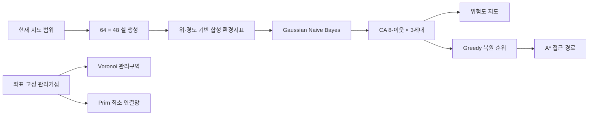

# LAND:15 — 사막화 대응 의사결정 랩

UN SDG 15.3의 토지 황폐화 중립과 사막화 방지를 주제로 만든 교육용 웹 프로토타입입니다. 실제 위성영상 베이스맵 위에서 사막화 위험 분류, 공간 확산, 관리구역 배정, 복원 우선순위와 접근 경로가 연결되는 과정을 체험할 수 있습니다.

[배포된 사이트 열기](https://leejuhan-1214.github.io/ToGangDDaKK/) · [상세 인수인계 문서](HANDOFF.md)

> **데이터 고지:** 배경 지도는 Esri World Imagery의 실제 위성영상이지만 실시간 영상은 아닙니다. 위험도, NDVI, 강수량, 토양 수분, 온도, 나지 비율, 비용 및 인구 수치는 모두 교육용 합성 데이터입니다. 현재 결과를 실제 환경평가나 정책 결정에 사용하면 안 됩니다.

## 프로젝트 한눈에 보기

| 항목 | 현재 상태 |
| --- | --- |
| 형태 | 빌드 과정과 백엔드가 없는 정적 웹앱 |
| 기본 지도 | Leaflet 1.9.4 + Esri World Imagery/경계·지명 타일 |
| 기본 분석 지역 | 고비 전이지대, 세네갈 북부 사헬, 아랄해 동부 |
| 공간 단위 | 현재 지도 화면을 64 × 48, 총 3,072개 셀로 재분할 |
| 위험 분류 | 6개 합성 환경지표를 입력으로 사용하는 Gaussian Naive Bayes |
| 공간 보정 | Moore 8-이웃 셀룰러 오토마타, 3세대 |
| 의사결정 | Voronoi, Greedy, Prim MST, A* |
| 배포 | `main` 푸시 시 GitHub Actions가 GitHub Pages에 자동 배포 |
| 상세 문서 | 구현 구조, 계산식, 검증, 한계와 다음 작업은 [HANDOFF.md](HANDOFF.md) 참고 |

## 바로 실행하기

별도 설치나 빌드는 필요하지 않습니다. 저장소를 복제한 뒤 로컬 정적 서버를 실행합니다.

```bash
git clone https://github.com/leejuhan-1214/ToGangDDaKK.git
cd ToGangDDaKK
python -m http.server 8000
```

브라우저에서 `http://localhost:8000`을 엽니다. CDN의 Leaflet·Google Fonts와 Esri 지도 타일을 불러오므로 인터넷 연결이 필요합니다. 파일을 직접 열어도 되지만 로컬 서버 실행을 권장합니다.

## 주요 사용 흐름

1. 고비·사헬·아랄해 중 기본 지역을 선택합니다.
2. 지도를 이동하거나 확대·축소하면 새로 보이는 화면 전체가 3,072개 셀로 다시 분석됩니다.
3. `지도에서 분석 구역 지정`을 누르고 지도에서 두 모서리를 선택하면 해당 사각 범위로 이동합니다.
4. 위험도 기준과 가상 예산을 바꾸어 위험 면적 및 복원 우선순위 변화를 확인합니다.
5. 레이어에서 위험도, 보로노이 관리구역, 프림 연결망과 A* 경로를 켜고 끕니다.
6. 셀을 클릭하면 좌표 기반 셀 ID와 합성 환경지표, 판정 기여도를 확인할 수 있습니다.

## 분석 파이프라인



위험 공간장과 관리거점은 화면 안의 상대 위치가 아니라 지도 좌표에 고정됩니다. 따라서 다른 지역으로 이동하면 다른 패턴이 나타나며, 같은 줌 단계에서 같은 지역으로 돌아오면 같은 공간적 경향이 유지됩니다.

## 저장소 구조

```text
.
├─ index.html                    # 화면 구조, 설명, 입력 컨트롤
├─ styles.css                   # 디자인 시스템, 지도·패널·반응형 스타일
├─ app.js                       # 데이터 생성, 알고리즘, Leaflet 렌더링, 이벤트
├─ HANDOFF.md                   # 상세 기술·운영 인수인계 문서
└─ .github/workflows/pages.yml  # GitHub Pages 자동 배포
```

## 최소 검증

변경 후 아래 검사를 수행합니다.

```bash
node --check app.js
git diff --check
```

그다음 브라우저에서 기본 지역 전환, 지도 이동, 줌 아웃, 구역 지정, 네 레이어 토글과 모바일 폭을 직접 확인합니다. 상세 체크리스트는 [HANDOFF.md의 검증 절차](HANDOFF.md#9-검증-절차)를 따릅니다.

## 배포

`main` 브랜치에 푸시하면 `.github/workflows/pages.yml`이 저장소 전체를 정적 사이트로 패키징해 GitHub Pages에 배포합니다. 배포 실패 시 저장소의 **Actions → Deploy static site to GitHub Pages** 로그를 확인합니다.

정적 자산을 수정했는데 브라우저에 이전 버전이 남으면 `index.html`의 `styles.css?v=...`, `app.js?v=...` 쿼리 버전을 함께 변경합니다.

## 교과 융합

- 수학 — 확률과 통계: 베이즈 정리, 조건부확률, 확률분포와 성능지표
- 과학 — 지구과학: 위성 원격탐사, 기후·토양·식생 상호작용
- 인문 — 세계지리: 건조지역, 토지 이용과 인간·환경 관계
- 정보 — 분류, 셀룰러 오토마타, 그래프, 공간·최적화 알고리즘

## 다음 담당자가 먼저 읽을 것

[HANDOFF.md](HANDOFF.md)에 현재 구현의 정확한 범위, 핵심 함수, 변경 시 영향 범위, 알려진 한계, 실데이터 전환 순서와 인수인계 체크리스트가 정리되어 있습니다. 특히 합성 데이터를 실제 관측값으로 오해시키지 않는 고지 문구를 유지해야 합니다.
